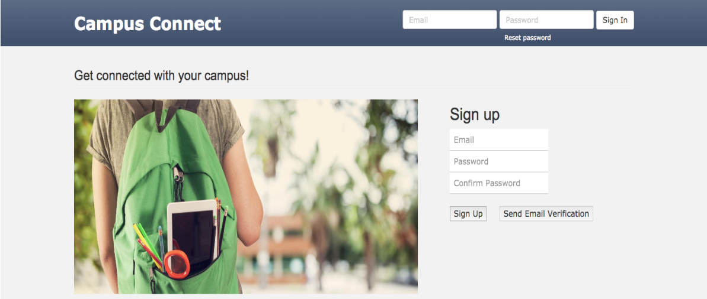
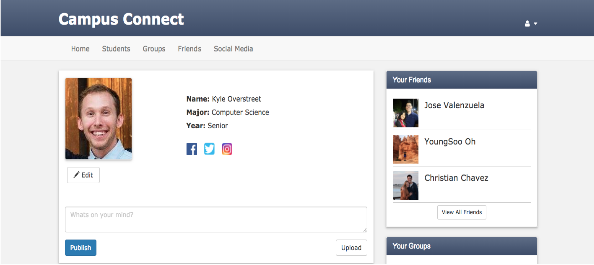
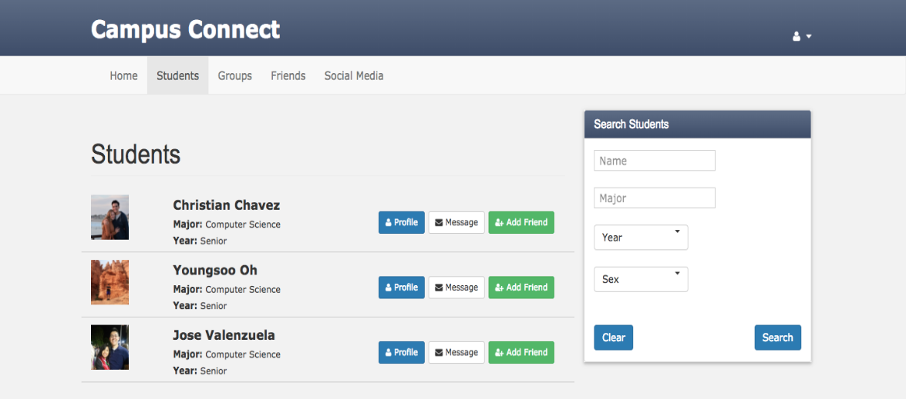

# Campus Connect
Social networking website

## About Campus Connect 

Campus Connect is a social media and social networking platform for California State University, Bakersfield students to connect with other students and with student organizations. Although large-scale platforms exist, they do not effectively accomplish our specific goal. Campus Connect aims to improve both the social aspect and the academic success of student life.

- 운영체제: Window 10 64bit, Linux
- 개발도구: FireBase, Digital Ocean,Postman
- DBMS: Mysql
- Program Language:  SQL, CSS, Bootstrap, PHP, HTML5, Javascript(Jquery)

- 메인 로그인, 회원가입 페이지로써
- 회원이면 헤더 로그인 기능으로 로그인을 할수있다.
- 비회원일시 Sign up 을 통해 정볼를 입력후 Campus Connect 를 이용할수있다.

 

- 프로파일 버튼을 누를 시 유저 정보를 확인할수있다.
- 유저와 친구를 볼수있도록 옆에 리스트를 놓았다.
- edit버튼을 누를시 회원 개인정보를 수정할수있다.

 

- 가입되어 있는 회원들을 검색할수 있는 기능이다.
- 생일, 이름, 성, 을 검색하여 그 정보에 의해 필터링 되어 리스트가 나온다.
- Add friend 버튼을 누를시 내 친구로 저장되어 진다.

 

